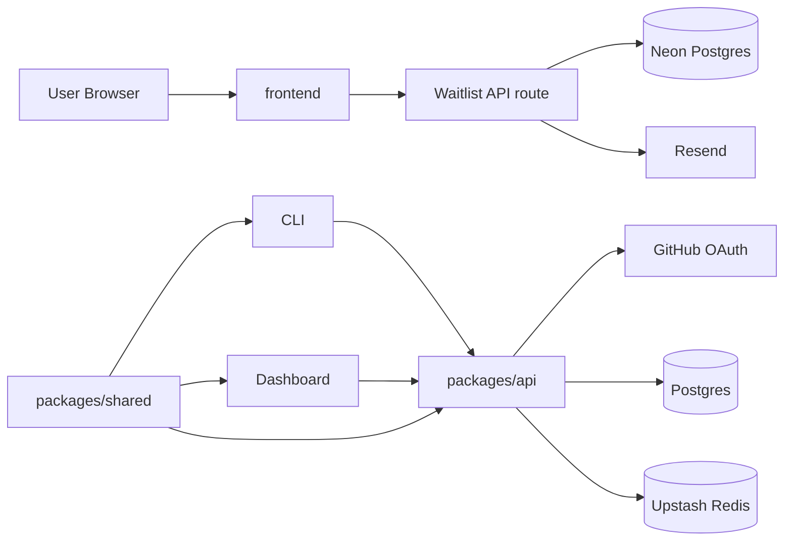
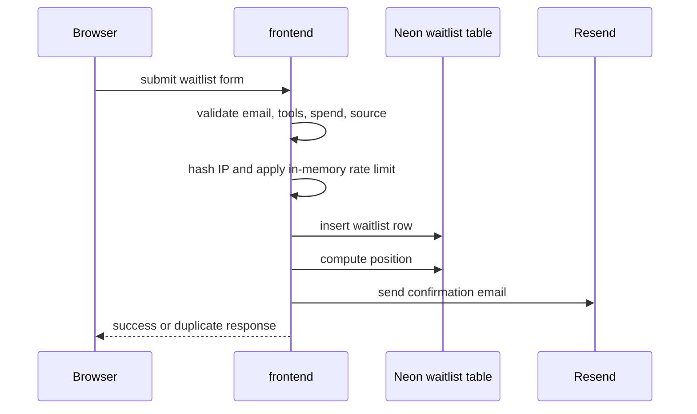
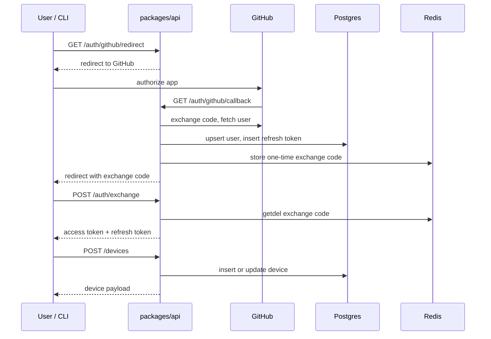

# Architecture Overview

## System Shape

DevDrip is currently a monorepo with two user-facing web apps, one backend API, one shared package, and one CLI package.

## Package Responsibilities

- `frontend`
  Public landing page, metadata assets, and `/api/waitlist`.
- `packages/api`
  Express app with auth, device registration, health checks, env handling, logging, rate limiting, and Drizzle schema.
- `packages/shared`
  Shared enums, domain types, and product constants.
- `packages/cli`
  Commander-based CLI entrypoint and command registration.
- `packages/dashboard`
  Separate Next.js app with minimal shell.

## Active Flows

### Landing and Waitlist

### Auth and Device Registration

## Important Boundaries

- waitlist intake lives in `frontend`, not `packages/api`
- waitlist persistence uses raw SQL against Neon, not shared Drizzle schema
- API runtime uses Postgres plus Redis
- CLI and dashboard do not yet implement their intended product flows
- shared types model more of the product than the runtime exposes today

## Runtime Notes

- `packages/api` checks DB and Redis on startup
- DB failure is fatal on startup
- Redis failure is tolerated on startup and in rate limiting paths
- `/health` returns `200` when DB is healthy, even if Redis is degraded
