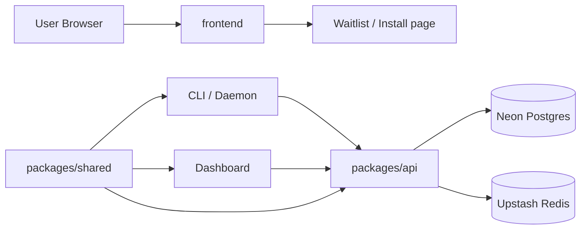
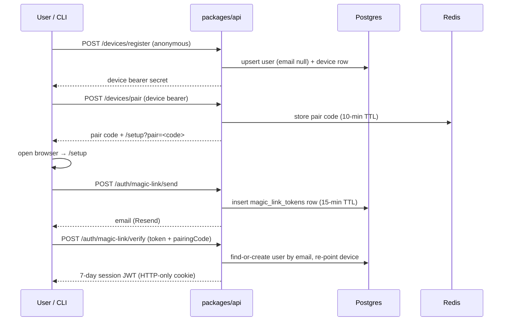

# Architecture Overview

## System Shape

Distro TV is a monorepo with a public landing page, one backend API, a user dashboard, one shared package, and a CLI package.



## Package Responsibilities

- `frontend`
  Public landing page at `distrotv.xyz`. Channels-first positioning (CH 01 NEWS, CH 02 MARKETS). Hosts `install.sh` as a static asset. Dashboard lives here too (`/dashboard/*`, auth-gated).
- `packages/api`
  Express app with layered architecture: thin routes → validators → services → Drizzle ORM. Covers magic-link auth, device registration, channel subscriptions, watchlists, alerts, slot selection and impression ingestion. Centralized error handling via typed error classes.
- `packages/shared`
  Shared enums, slot payload types, channel-mode constants, and the `env-bundle` for cross-package URL resolution.
- `packages/cli`
  Commander-based CLI. Binary: `distro` (alias: `dtv`). Distributed via curl + GitHub Releases.
- `packages/dashboard`
  Merged into `frontend/` — there is no separate dashboard package. The dashboard lives at `frontend/app/dashboard/`.

## Active Flows

### Install

```
curl -fsSL https://distrotv.xyz/install.sh | sh
  → node 20+ check
  → download latest tarball from GitHub Releases
  → extract to ~/.distrotv/
  → drop wrapper at ~/.local/bin/distro
```

### Init + Auth



### Slot delivery (daemon loop)

```
claude hooks fire (PreToolUse / UserPromptSubmit)
  → 3s grace period
  → daemon picks next slot from local cache
     (news via /me/content/next, ticker via /me/content/next)
  → renders to terminal scroll region (DECSTBM)
  → vanishes on Stop hook or vanish timer (<200ms from Stop)
  → POST /ingest (background sync loop, 5-min interval)
```

## Important Boundaries

- install script lives in `frontend/public/install.sh`; served as a static Vercel asset
- waitlist intake is gone post-M1; the landing page has no form submission
- API runtime uses Neon Postgres + Upstash Redis
- daemon is a per-user singleton over a Unix socket
- local ledger (SQLite at `~/.distro/ledger.db`) is ground truth for slot impressions — backend can be down
- hooks always exit 0 — never block the tool runner
- CI suppression is a client-side concern (CLI checks `process.env.CI` and skips calling the API)

## Runtime Notes

- `packages/api` checks DB and Redis on startup
- DB failure is fatal on startup
- Redis failure is tolerated on startup and in rate-limiting paths
- `/health` returns `200` when DB is healthy, even if Redis is degraded
- news fetcher worker runs on `*/5 * * * *` inside `packages/api/src/worker.ts`
- ticker fetcher worker runs on `*/1 * * * *` alongside the news cron
